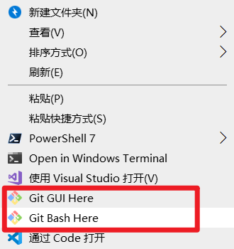

# Git版本控制操作

### 什么是Git

------

Git是一种分布式版本控制系统，主要用于软件开发，它允许多个开发者在同一项目上并行工作，并确保他们的工作不会互相冲突。

###  Git的安装

------

[下载地址](https://git-scm.com/download/win)

注意：不要安装在中文目录 

安装很简单，一直下一步即可。在任意的目录下右键，能看到菜单, 就表示安装成功了。



说明：Mac的安装可以查看官网说明[在 macOS 上安装](https://git-scm.com/book/zh/v2/%E8%B5%B7%E6%AD%A5-%E5%AE%89%E8%A3%85-Git)

在终端里尝试首次运行 *git* 命令即可。如果没有安装过git，将会提示你安装。

###  Git三个区

<hr>

> 要对某个项目使用git进行管理，需要使用`git init`命令初始化git仓库

`git init`会在当前目录生成一个隐藏文件夹 `.git`  不要去修改这个文件夹下的任意东西。

### Git仓库会分成三个区

<hr> 

- 工作区：我们书写代码的地方，工作的目录就叫工作区。

- 暂存区：暂时存储的区域，在git中，代码无法直接从工作区提交到仓库区，而是需要先从工作区添加到暂存区，然后才能从暂存区提交到仓库区。暂存区的目的是避免误操作。

- 仓库区：将保存在暂存区域的内容永久转储到 Git 仓库中，生成版本号。生成版本号之后，就可以任何的回退到某一个具体的版本。

## git基本命令

<hr>

### git init

**作用**：初始化git仓库，想要使用git对某个项目进行管理，需要`git init`进行初始化

```
# 初始化仓库， 在当前目录下生成一个隐藏文件夹.git
git init
```

### git add

**作用**：将文件由 `工作区` 添加到 `暂存区`，在git中，文件无法直接从工作区直接添加到仓库区，必须先从工作区添加到暂存区，再从暂存区添加到仓库区。

**命令**：`git add 文件名/目录名`

```
# 将index.html添加到暂存区
git add index.html

# 将css目录下所有的文件添加到暂存区
git add css

# 添加当前目录下所有的文件
git add .
git add --all
```

### git commit

**作用**：将文件由 暂存区 添加到 仓库区，生成版本号（存档）

```
# 将文件从暂存区提交到仓库
git commit -m "提交说明"

# 如果不写提交说明，会进入vi编辑器，没有写提交说明，是提交不成功的。 需要知道如何退出 输入 :q!
git commit
```

### git config配置

如果是第一次提交，需要配置提交者信息

这两条配置是很重要的，每次提交 git 代码都会引用这两条信息，记录了谁提交了代码，会永久的记录在历史记录中。

```
# 使用 --global 参数，配置全局的用户名和邮箱，只需要配置一次即可
git config  --global user.name "web189"
git config  --global user.email "isdemo@qq.com"

# 可以再次通过运行命令来修改它们。

# 查看配置信息
git config --list
```

### git status

**作用**：查看文件的状态

**命令**：`git status` 

- 红色表示工作区中的文件需要提交
- 绿色表示暂存区中的文件需要提交

### git log

**作用**：查看提交日志

`git log` 查看提交的日志

### git重置

### git reset

**作用**：版本回退，将代码恢复到已经提交的某一个版本中。

- `git reset --hard 版本号` 将代码回退到某个指定的版本(版本号只要有前几位即可)


- 当使用了`git reset`命令后，版本会回退，使用`git log`只能看到当前版本之前的信息。
  git reflog 查看仓库中所有的提交日志信息
- git log --oneline 可以一行输出提交日志信息

### git忽视文件

> 在仓库中，有些文件是不想被git管理的，比如数据的配置密码、写代码的一些思路，node_modules文件夹等。git可以通过配置从而达到忽视掉一些文件，这样这些文件就可以不用提交了。

在仓库的根目录创建一个`.gitignore`的文件，文件名是固定的。

将不需要被git管理的文件路径添加到`.gitignore`中

```bash
# 忽视idea.txt文件
idea.txt

# 忽视css文件夹
css/

# 忽视css下的index.js文件
css/index.js

# 忽视css下的所有的js文件
css/*.js
```

要养成一开始就为你的新仓库设置好 .gitignore 文件的习惯，以免将来误提交这类无用的文件。

### 复习

```
git init 初始化一个git仓库 让git管理项目

git add . 工作区的代码文件添加到暂存区

git commit -m '提交说明信息'

git status 查看文件状态

git log 查看提交日志   git reflog 更全

git reset --hard 版本号  版本回退

git 忽视文件  文件.gitignore

# 分支
查看分支  git branch
新建分支  git branch 分支名
切换分支  git checkout 分支名
删除分支  git branch -d 分支名
创建并切换分支  git checkout -b 分支名
合并分支    git merge 分支名  比如：将user分支合并到master主分支
			1. 先切换到master
			2. 在执行 git merge user
出现了冲突咋办？   先保留代码 + git add . + git commit -m ''

# 远程仓库
1. 码云账号注册好，登录好
2. 去创建仓库
```

## git分支命令

<hr>

### 创建分支

- `git branch 分支名称`创建分支，分支中的代码，**在创建时与当前分支的内容完全相同。**
- git在第一次提交时，就有了一个叫`master`的主分支。
- `git branch dev`，创建了一个叫做dev的分支

### 查看分支

- `git branch`可以查看所有的分支
- 在当前分支的前面会有一个`*`

### 切换分支

- `git checkout 分支名称`切换分支
- 在当前分支的任何操作，都不会影响到其他的分支，除非进行了分支合并。
- 提交代码时，会生产版本号

### 创建并切换分支

- `git checkout -b 分支名称` 创建并切换分支

### 删除分支

- `git branch -d 分支名称` 可以删除分支
- **注意**：不能在当前分支删除当前分支，需要切换到其他分支才能删除。
- 注意：`master`分支是可以删除的，但是不推荐那么做。

### 合并分支

- `git merge 分支名称` 将其他分支的内容合并到当前分支。
- 在`master`分支中执行`git merge dev` 将`dev`分支中的代码合并到`master`分支
- [分支合并](https://git-scm.com/book/zh/v1/Git-%E5%88%86%E6%94%AF-%E5%88%86%E6%94%AF%E7%9A%84%E6%96%B0%E5%BB%BA%E4%B8%8E%E5%90%88%E5%B9%B6)


### git合并冲突

- 对于同一个文件，如果有多个分支需要合并时，容易出现冲突。
- 合并分支时，如果出现冲突，只能手动处理，再次提交，一般的作法，把自己的代码放到冲突代码的后面即可。


## git远程仓库

> 以后公司会有一台服务器作为公司的远程仓库。

### github与git

git与github没有直接的关系。

- git是一个版本控制工具。

- github是一个代码托管平台，开源社区，是git的一个远程代码仓库。

- gitHub是一个托管平台，因为只支持git 作为唯一的版本库格式进行托管，故名gitHub。

  创建git项目时，不能有中文。

[github官网](https://github.com/)

[开源中国-git](https://git.oschina.net/)

### git clone

- 作用：克隆远程仓库的代码到本地

- git clone [远程仓库地址]

- git克隆默认会使用远程仓库的项目名字，也可以自己指定。

  需要是使用以下命令：`git clone [远程仓库地址] [本地项目名]`

### git push

- 作用：将本地仓库中代码提交到远程仓库
- `git push 仓库地址 master` 在代码提交到远程仓库，注意master分支必须写，不能省略

### git pull

- 作用：将远程的代码下载到本地


- 通常在push前，需要先pull一次。

```bash
# 获取远程仓库的更新，并且与本地的分支进行合并
git pull
```


### git remote

每次push操作都需要带上远程仓库的地址，非常的麻烦，我们可以给仓库地址设置一个别名

```bash
# 给远程仓库设置一个别名
git remote add 仓库别名 仓库地址
git remote add demo 仓库地址

# 删除demo这个别名
git remote remove demo

# 通过git clone的仓库默认有一个origin的别名

# 查看当前仓库中的所有别名
git remote -v
```


### SSH免密码登陆

git支持多种数据传输协议：

- https协议：`https://github.com/webman158/demo76.git`  需要输入用户名和密码
- ssh协议：`git@github.com:webman158/demo76.git`   可以配置免密码登录

每次push或者pull代码，如果使用https协议，那么都需要输入用户名和密码进行身份的确认，非常麻烦。

- github为了账户的安全，需要对每一次push请求都要验证用户的身份，只有合法的用户才可以push
- 使用ssh协议，配置ssh免密码，可以做到免密码往github推送代码


### SSH免密码登录配置

注意：这些命令需要在bash中敲

- 1 创建SSH Key：`ssh-keygen -t rsa` 敲3次回车
- 2 在文件路径 `C:\用户\当前用户名\` 找到 `.ssh` 文件夹
- 3 文件夹中有两个文件：
  - 私钥：`id_rsa`
  - 公钥：`id_rsa.pub`
- 4 在 `github -> settings -> SSH and GPG keys`页面中，新创建SSH key
- 5 粘贴 公钥 `id_rsa.pub` 内容到对应文本框中
- 5 在github中新建仓库或者使用现在仓库，拿到`git@github.com:用户名/仓库名.git`
- 6 此后，再次SSH方式与github“通信”，不用输入密码确认身份了